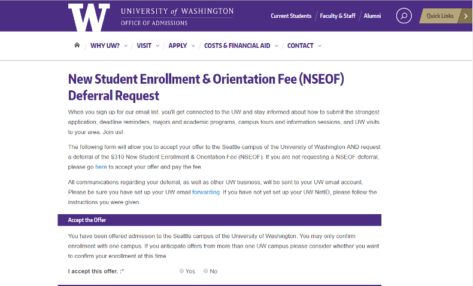

# Registrar

University of Washington, Office of the University Registrar themes for the [Athens](https://github.com/AthensFramework/core) web framework.


<br>
*Attractive, easy on-brand pages for* Athens *using these templates.*

## Use

These templates are for the [Athens](https://github.com/AthensFramework/core) web framework. You must be using Athens to use these templates.

1. Add the Registrar theme templates to the package requirements in your `composer.json`:

  ```
  "require": {
        ...
        "athens/core": "0.*",
        "uwdoem/registrar": "0.*",
        ...
  },
  ```
  
  The major version number of `uwdoem/boundless` should be the same as your major version number of `athens/core`.

2. Add the Registrar and Boundless templates in your project's `setup.php`, **above** the line that adds your project-templates (order matters!):
  ```
  Settings::addTemplateDirectory(dirname(__FILE__) ."/vendor/uwdoem/registrar/templates");
  Settings::addTemplateDirectory(dirname(__FILE__) ."/vendor/uwdoem/boundless/templates");
  Settings::addTemplateDirectory(dirname(__FILE__) ."/project-templates");
  ```


## License

Because this repository contains significant Unviersity of Washington trademark elements, it is NOT licensed for reuse by any party who is not licensed to present University of Washington trademark elements. See the University of Washington [Trademarks & Licensing group](https://www.washington.edu/trademarks/) for more information.

If you are a department or division of the University of Washington, please feel free to use Athens and these templates, conditioned upon your acceptance of the following statement:

  THE SOFTWARE IS PROVIDED "AS IS", WITHOUT WARRANTY OF ANY KIND, EXPRESS OR IMPLIED, INCLUDING BUT NOT LIMITED TO THE WARRANTIES OF MERCHANTABILITY, FITNESS FOR A PARTICULAR PURPOSE AND NONINFRINGEMENT. IN NO EVENT SHALL THE AUTHORS OR COPYRIGHT HOLDERS BE LIABLE FOR ANY CLAIM, DAMAGES OR OTHER LIABILITY, WHETHER IN AN ACTION OF CONTRACT, TORT OR OTHERWISE, ARISING FROM, OUT OF OR IN CONNECTION WITH THE SOFTWARE OR THE USE OR OTHER DEALINGS IN THE SOFTWARE.
  
Copyright (c) 2016 University of Washington, Seattle, WA
